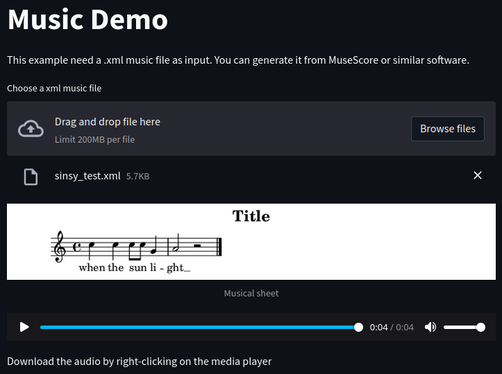

# Music Streamlit demo

This is a streamlit demo App for music application.



## Run

```
# ubuntu/debian based
sudo apt-get install -y lilypond 
# opensuse
sudo zypper in lilypond

python3.8 -m pip install -r requirements.txt
python3.8 -m streamlit run app.py
firefox http://localhost:8501
```

# Reference
Here I list the basic knowledge used to implement this project.
* python and pip
* [Sreamlit](https://streamlit.io/): GUI library
* [Music21](http://web.mit.edu/music21/): to read and plot .xml music
* [LillyPond](https://lilypond.org/): dependecy of Music21 to plot partiture
* [pretty_midi](http://craffel.github.io/pretty-midi/): to read mid and synthesize it into a wav
* [note_seq](https://github.com/magenta/note-seq/): to plot piano roll
* [bokeh](https://bokeh.org/): used from note_seq to plot piano roll
* [numpy](https://numpy.org/): for math operations
* [scipy](https://scipy.org/): to save wave (TODO: should it be better to do with other libs?)